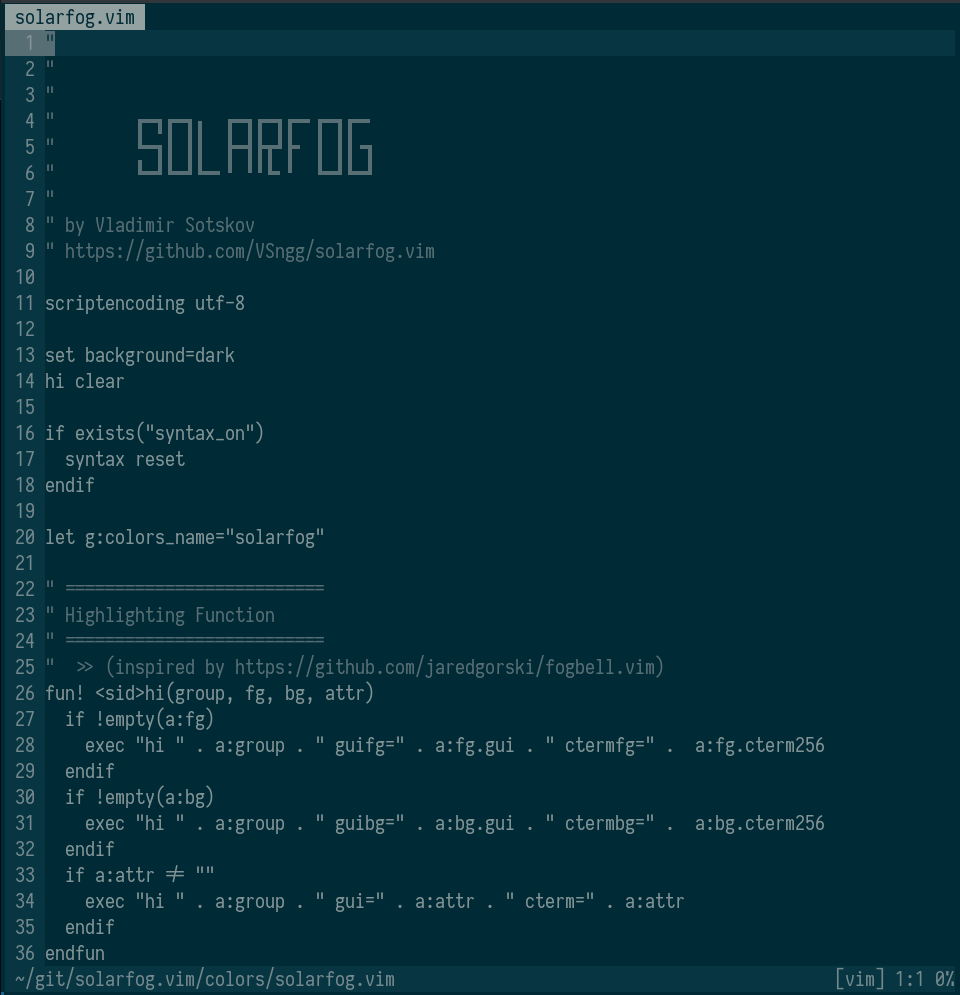

## Solarfog.vim

Vim colorscheme based on solarized with minimal syntax highlighting

### Screenshot

### Installation

    Plug 'VSngg/solarfog.vim'
    
### Usage

    set termguicolors
    colorscheme solarfog

### Thanks

Based on [jaredgorski/fogbell.vim](https://github.com/jaredgorski/fogbell.vim)
colorscheme.
